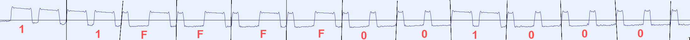

# Reverse the F-Machine remotes protocol.

The F-Machine devices tested (Gigolo & Tremblr) both come with a remote with 3 or 5 buttons.


They control a [SC2262](http://www.sc-tech.cn/en/SC2262.pdf) encoder that sends tri-states bits (1/0/F) as fixed code commands. These are used to then control a 315Mhz RF transmitter to send these as ASK/OOK encoded.

As noted on [their website](https://f-machine.com/index.php/remote-control-detail), F-Machine uses 5 different types (A to E), probably with different commands, and maybe different frequencies.

## Listening to the transmissions

Using a cheap USB [RTLSDR](https://www.adafruit.com/product/1497), there are two ways to listen to the communications

### Easy way with rtl_433

using [rtl_433](https://github.com/merbanan/rtl_433) to decode the transmissions is as easy as running: `rtl_433 -f  315M -d0` and pressing the buttons on the remote.

Example code for the Gigolo A remote, and the ON/OFF button:

```
time      : 2021-04-14 14:42:48
model     : Generic-Remote                         House Code: 21887
Command   : 48           Tri-State : ZZZZZ1110100
```

### Hard way with gqrx

one can use [gqrx](https://gqrx.dk/) to listen to the transmitted frames.


Setting it in AM mode, transmissions can me recorded as a .wav file  after clicking the `Rec` button.

Opening them in Audacity, we end up with the following traces for each button presses:

 * Gigolo (Remote A)
   * Up button (command `FFFFF1111000`) 
   * ON/OFF button (command `FFFFF1110010`) 
   * Down button (command `FFFFF1110100`) 

 * Tremblr (Remote B)
   * Up button (command `11FFFF000010`) 
   * ON/OFF button (command `11FFFF000010`) 
   * Down button (command `11FFFF000100`) 
   * Suck Up button (command `11FFFF000001`) 
   * Suck Down button (command `11FFFF010000`) 


The .wav files for each remote can be found here (button are pressed top left to bottom-right):

 * [gigolo](docs/gqrx_am_traces/fmachine_gigolo_a/top-down-buttons.wav)
 * [tremblr](docs/gqrx_am_traces/fmachine_tremblr_a/top-down-buttons.wav)

## Protocol

Each command noted above, are repeatedly sent, and a command needs to be repeated at least 6 times to be acknowledged by the machine.
A pause in transmission is required before sending another command.
