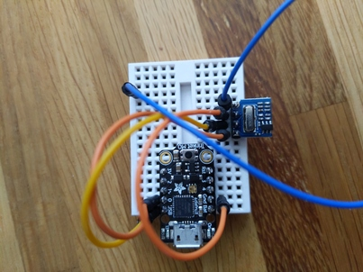

# RFmachine
Arduino code to control F-Machine devices via a H34A 315Mhz dongle.

Supported devices are:

 * [F-Machine Gigolo (remote type 'A')](https://f-machine.com/index.php/gigolo-detail)
 * [F-Machine Tremblr (remote type 'A')](https://f-machine.com/index.php/tremblr-detail)

As noted on [their website](https://f-machine.com/index.php/remote-control-detail), F-Machine uses 5 different types (A to E), probably with different commands, and maybe different frequencies.

## Hardware

Any Arduino compatible device should do. Tested on a [Adafruit Trinket M0](https://www.adafruit.com/product/3500).

For the transciever I use a cheap [H34A in 315Mhz version](https://de.aliexpress.com/item/4000511964218.html) but any ASK/OOK 315Mhz emitter should work.

Just connect some wire to `ANT`, `VCC` to some 5V, `GND` to the ground, and `DATA` to your arduino data pin (D0 is the default in my code).

It is worth noting here that you won't be able to simply re-implement the Tremblr remote (using 5 buttons) with a Trinket M0, because it has only 5 exposed digital pins, and one is required to control the H34A.

## Software

Unfortunately, because Python is a bit heavy, it's hard to make it do proper sub-millisecond timings on microcontrollers, that's why the code is (horrible) C++.

### Usage

Just load `rfmachine.ino` in your Arduino IDE, edit the `loop()` command to your desires, and flash it on the required device.

## Reversing the F-Machine protocol

More information can be found in the [NOTES.md](NOTES.md) file.
